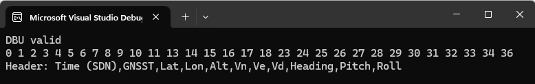
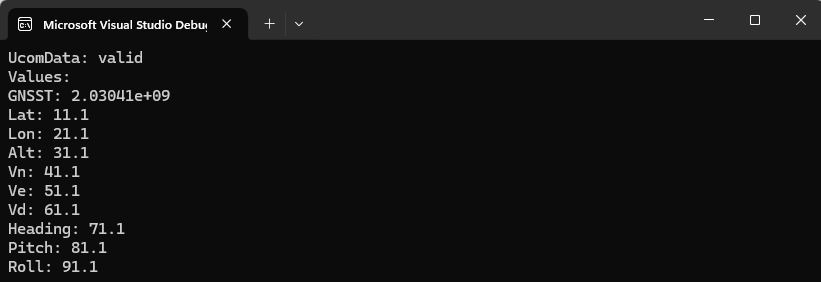
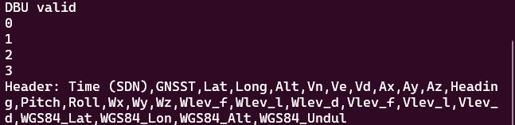
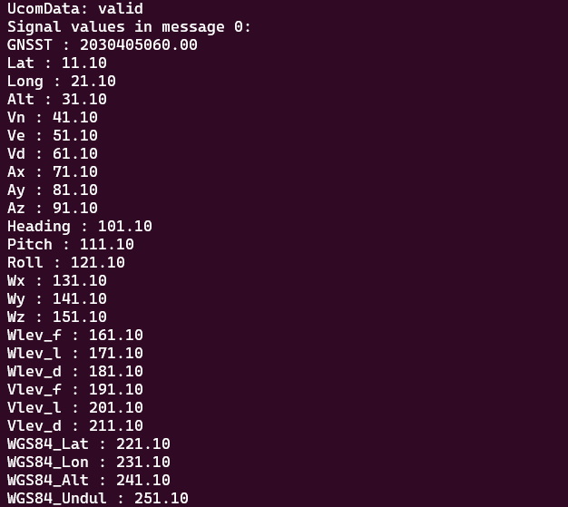
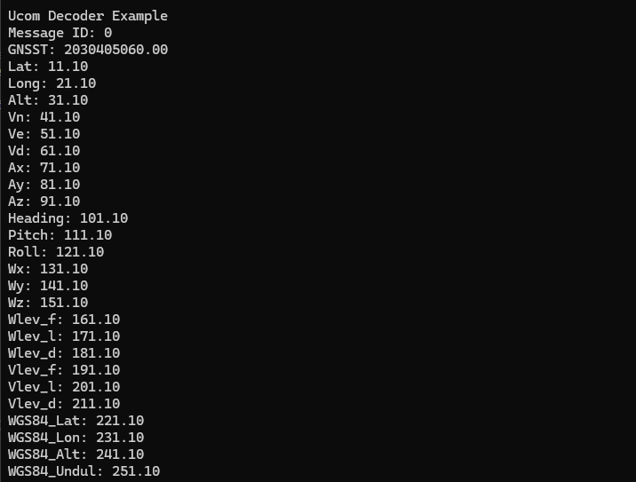

# UCOM Decoder

> [!IMPORTANT]
> The materials in this repository are relevant to the ucoming NavSuite 3.15 release (UCOM Version 1).

This repository contains the code to build and install the UCOM Decoder Library, 
as well as an example tool which can convert UCOM data from UDP stream or file 
to CSV file.

## Third-Party Libraries
This project makes use of the following third-party open-source libraries:

- nlohmann/json for JSON parsing
- pybind11 for C++ / Python bindings

See the relevant sub-folder for their licences.

## Clone the repository

```sh
git clone --recursive https://github.com/OxfordTechnicalSolutions/ucom-decoder.git
```

The repository must be cloned recursively as the UCOM decoder uses a sub-module 
for the JSON parser.
<!--toc:start-->
- [UCOM Decoder](#ucom-decoder)
  - [Third-Party Libraries](#third-party-libraries)
  - [Clone the repository](#clone-the-repository)
  - [Build](#build)
    - [Visual Studio](#visual-studio)
      - [Quick Start](#quick-start)
    - [Linux](#linux)
  - [UCOM to CSV command-line options](#ucom-to-csv-command-line-options)
  - [Example Data](#example-data)
  - [Python](#python)
    - [Requirements](#requirements)
    - [Installation](#installation)
- [Tests](#tests)
  - [All tests](#all-tests)
  - [Unit tests](#unit-tests)
- [Decoding UCOM](#decoding-ucom)
  - [Overview](#overview)
  - [UCOM](#ucom)
    - [UCOM Packet](#ucom-packet)
      - [Header](#header)
      - [Payload](#payload)
    - [Decoding](#decoding)
  - [ucom_to_csv](#ucomtocsv)
    - [Description](#description)
    - [Windows](#windows)
      - [ucom_to_csv arguments](#ucomtocsv-arguments)
  - [SDK](#sdk)
    - [C++ API](#c-api)
    - [class UcomDbu](#class-ucomdbu)
      - [Description](#description-1)
    - [class UcomData](#class-ucomdata)
      - [Description](#description-2)
    - [class UcomMessage](#class-ucommessage)
      - [Description](#description-3)
    - [class UcomSignal](#class-ucomsignal)
      - [Description](#description-4)
    - [Python API](#python-api)
    - [class UcomDbu](#class-ucomdbu-1)
      - [Description](#description-5)
    - [class UcomData](#class-ucomdata-1)
      - [Description](#description-6)
    - [class UcomMessage](#class-ucommessage-1)
      - [Description](#description-7)
    - [class UcomSignal](#class-ucomsignal-1)
      - [Description](#description-8)
  - [Examples](#examples)
    - [C++](#c)
      - [1. Parse DBU and display message info](#1-parse-dbu-and-display-message-info)
      - [2. Decoding data](#2-decoding-data)
    - [Python](#python-1)
      - [1. Parse DBU and display message info](#1-parse-dbu-and-display-message-info-1)
      - [2. Decoding data](#2-decoding-data-1)
  - [Using UCOM decoder library for development](#using-ucom-decoder-library-for-development)
    - [Visual Studio - Windows](#visual-studio-windows)
      - [Create a project](#create-a-project)
      - [Set Includes and Library Dependencies](#set-includes-and-library-dependencies)
    - [Visual Studio Code - Linux (WSL2)](#visual-studio-code-linux-wsl2)
      - [Create CMakeLists.txt](#create-cmakeliststxt)
      - [Write your program code](#write-your-program-code)
      - [Configure, build and run](#configure-build-and-run)
<!--toc:end-->

## Build

### Visual Studio
The project is set up to allow cross-platform build (Windows / Linux) using 
Visual Studio 2022. The Linux build would most commonly use WSL2, but it is 
possible to use other remote hosts or build in Linux directly.

To start, open the project folder in Visual Studio. VS should automatically 
detect the CMake files and make the configurations available in the menu.

#### Quick Start
Select the host, e.g.:
Local Machine for Windows build
WSL: Ubuntu for Linux build

Select the build configuration, e.g.:
x64 Debug

Select the 'Startup Item', e.g.:
ucom_decoder.exe

Run the selected configuration

### Linux

```sh
mkdir build && cd build
cmake ..
cmake --build .
```

To build and install the library, replace `cmake --build .` with 

```sh
cmake --build . --target install
```

If there are permission errors, re-run the above command as root with `sudo`.

The executable is found in the build/ucom_to_csv directory named `ucom_to_csv`.


## UCOM to CSV command-line options

Running UCOM to CSV with no arguments produces the following output:

```
Usage: ucom_to_csv [options] -u <.dbu filename>
Options:
  -h                     Help - displays this message
  -f <input file>        Extract data from a file instead of UDP stream
  -m <id1 id2 id3 ...>   Message IDs to process, e.g. 0 1 3
  -c <packets>           Number of packets to process (UDP stream only)
  -t <duration>          Maximum capture duration in seconds (UDP stream only)
  -i <address>           Source IP address (UDP stream only)
  -o <output file>       Output file prefix (default is output_)
  -a                     Disable user-abort
```

## Example Data

The `example_data` directory contains:

- UCOM file, logged from an OXTS INS
- .cfg file, showing how the unit is configured
- mobile.dbu file (in dbu sub-directory) - contains message definitions which are parsed by the decoder. This allows the decoder flexibility to decode new messages when 
provided with updated definitions.

To use this data with the UCOM to CSV tool:

```sh
./ucom_to_csv -u ../../example_data/dbu/mobile.dbu -f ../../example_data/input.ucom
```
## Python
There is a Python version of the UCOM decoder SDK.

### Requirements
The code has been tested with Python 3.12. It may work with earlier versions, but if any issues with package dependencies are encountered then it is recommended to upgrade to at least Python 3.12.

### Installation
1. Create a working folder and clone the UCOM_decoder repository:

```sh
mkdir ucompy_test
cd ucompy_test
git clone https://github.com/OxfordTechnicalSolutions/ucom-decoder.git --recursive ucom_decoder
```

2. Create Python virtual environment:  
NB Use the appropriate command (instead of python) to invoke the Python interpreter on your system, e.g. py, python, python3. 

```sh
python -m venv venv
```

[Windows Command Prompt] 
```cmd
venv\Scripts\activate.bat
```

[Windows Powershell]
```powershell
venv\Scripts\Activate.ps1
```

[Linux]
```sh
source venv/bin/activate
```

3. Install the oxts.ucompy module:

```sh
python -m pip install ucom_decoder/ucom_decoder_py
```

4. Test the installation:  
a. Start Python interactive shell

```sh
python
```

Enter the text following the prompts (>>>) line by line. You should see the output shown:
```Python
>>> from oxts.ucompy import UcomDbu
>>> u = UcomDbu("ucom_decoder/example_data/dbu/oxts.dbu")
>>> u.get_valid()
True 
>>> u.get_filename()
'ucom_decoder/example_data/dbu/oxts.dbu'
>>> quit()
```

b. Run the ucom_to_csv example:
```powershell
ucom_decoder\ucom_decoder_py\examples\ucom_to_csv\test.bat
```
5. Uninstall:
```sh
python -m pip uninstall ucompy
```

# Tests

## All tests

To run all of the automated tests, first build ucom_to_csv and then from the **ucom_decoder/test/** folder, run:

Windows
```powershell
.\run_tests.bat
```
Linux
```sh
./run_tests.sh
```

The automated unit tests run on the Python bindings to simultaneously test the bindings and the underlying (bound) C++ code.

There is also a test of the overall (C++) decoder functionality using automatically-generated UCOM data. A range of known values are encoded into UCOM packets. These packets are then decoded (using ucom_to_csv) and the extracted values are compared with the original values.

## Unit tests
The Python unit tests can be run on their own by changing to the **ucom_decoder_py/tests** folder and running:

Windows
```powershell
.\run_tests.bat
```
Linux
```sh
./run_tests.sh
```

# Decoding UCOM 

## Overview
UCOM provides the facility to customise the data that is output by an OXTS INS by using user-defined messages. 
These user-defined messages are specified in a mobile.dbu file. For ease of explanation, hereafter the term DBU will be used to refer to .dbu files, such as oxts.dbu and mobile.dbu, or their content.

## UCOM
### UCOM Packet
UCOM data is sent in the form of packets that are made up of:
* 16-byte header
* Variable length payload
* CRC integrity check (32-bit)

#### Header
* Bytes 14-15 : Payload length in bytes

#### Payload
The data associated with each signal is contained in the payload as a sequence of bytes whose layout is determined by the messages defined in the DBU.

Each message contains an array of signals (named 'SignalsInMessage' in the DBU), and each signal contains a number of properties (key : value pairs). One of these properties is *DataType*. When decoding UCOM *DataType* is used to determine the size in bytes of the signal data in the payload.

Example:

[DBU excerpt]

```json
           "SignalsInMessage": [
                {
                    "SourceID": "TIME",
                    "SignalID": "GNSST",
                    "Unit": "s",
                    "ScaleFactor": 1,
                    "Offset": 0,
                    "DataType": "S64"
                },
                {
                    "SourceID": "BNS_SDN",
                    "SignalID": "Lat",
                    "Unit": "deg",
                    "ScaleFactor": 1,
                    "Offset": 0,
                    "DataType": "F64"
                },
                {
                    "SourceID": "BNS_SDN",
                    "SignalID": "Lon",
                    "Unit": "deg",
                    "ScaleFactor": 1,
                    "Offset": 0,
                    "DataType": "F64"
                },

```

These three signals are each 64 bits - or 8 bytes - long (as are the vast majority of the signals), so their representation in the payload will be as follows:
```
A0 A1 A2 A3 A4 A5 A6 A7 B0 B1 B2 B3 B4 B5 B6 B7 C0 C1 C2 C3 C4 C5 C6 C7 
```
where A0 ... A7, B0 ... B7, C0 ... C7 are the bytes representing the three messages A = GNSST, B = Lat, C = Lon above.

If message A is 8 bytes, message B is 1 byte and message C is 4 bytes:
```
A0 A1 A2 A3 A4 A5 A6 A7 B0 C0 C1 C2 C3
```

For full details of the UCOM protocol see [the UCOM manual](https://support.oxts.com/hc/en-us/articles/21438957524252-UCOM-Manual).

### Decoding
The steps required to decode UCOM are:

1. Extract message and signal information from the DBU
2. Read UCOM data (from file, UDP etc.)  
  a. Decode the header 
  b. Decode the payload
  c. Calculate the CRC
3. Repeat from 2. as required

## ucom_to_csv
### Description
This example code demonstrates usage of the UCOM decoder SDK to decode UCOM data and write it to .csv files. 
### Windows

Clone repo (see above)

Open a 'Developer Command Prompt for VS'

Navigate to the UCOM_decoder folder and then build 

```powershell
mkdir build && cd build
cmake ..
cmake --build . --config Release
```

Start capturing UCOM packets from UDP:
```powershell
cd ..
mkdir test && cd test
..\build\ucom_to_csv\Release\ucom_to_csv.exe -u ..\example_data\dbu\oxts.dbu -i any
```
#### ucom_to_csv arguments

Calling ucom_to_csv.exe with no arguments (or with -h) will display the options:

```
Usage: ucom_to_csv [options] -u <.dbu filename>
Options:
  -h                     Help - displays this message
  -f <input file>        Extract data from a file instead of UDP stream
  -m <id1 id2 id3 ...>   Message IDs to process, e.g. 0 1 3
  -c <packets>           Number of packets to process (UDP stream only)
  -t <duration>          Maximum capture duration in seconds (UDP stream only)
  -i <address>           Source IP address (UDP stream only)
  -o <output file>       Output file prefix (default is output_)
  -a                     Disable user-abort
```

The -u argument is required as it specifies the DBU that is needed for decoding the UCOM data.

Usually, when capturing packets from UDP, you will specify the source IP address using the '-i' flag, e.g. '-i 192.168.1.100' will only capture packets originating from the INS with that IP address. If there is only one INS connected to your network, then you can specify 'any' and there will be no IP filtering, i.e. use '-i any'.

## SDK
### C++ API
### class UcomDbu
#### Description
This class accepts a DBU filename as an argument to its constructor and parses the JSON contained in the DBU to generate collections of UcomMessages and UcomSignals.

<dl>
<dt>UcomDbu(std::string filename)</dt>
<dd>Constructs a UcomDbu instance from a DBU file <filename>. The file must be valid JSON conforming to the DBU schema.</dd>
<dt>std::string get_filename()</dt>
<dd>Gets the filename of the DBU.</dd>
<dt>bool get_valid()</dt>
<dd>Gets the 'valid' status of the instance. Returns true if the DBU file was parsed without error; false otherwise.</dd>
<dt>bool message_id_exists(uint16_t message_id)</dt>
<dd>Returns true if <message_id> exists in the collection of messages in the DBU; false otherwise.</dd>
<dt>std::map&ltuint16_t, UcomMessage&gt& get_messages()</dt>
<dd>Gets a collection containing all of the UCOM message definitions in the DBU, stored as key : value pairs whose key is the message ID.</dd>
<dt>std::list&ltuint16_t&gt& get_message_ids()</dt>
<dd>Gets a collection containing the message IDs of all of the UCOM message definitions in the DBU.</dd>
<dt>const UcomMessage& get_message(int id)</dt>
<dd>Gets the UcomMessage whose ID is &ltid&gt</dd>
<dt>const std::vector&ltucom_signal_ptr_t&gt &get_signals(uint16_t message_id)</dt>
<dd>Gets a collection containing all of the signals in the UcomMessage whose ID is &ltmessage_id&gt.</dd>
<dt>static OxTS::Enum::BASIC_TYPE get_data_type(const std::string& data_type)</dt>
<dd>Gets the OxTS::Enum::BASIC_TYPE from the string representation of the type.</dd>
</dl>

### class UcomData
#### Description
This class decodes a UCOM packet and allows read-access to the signal values contained within. To decode a UCOM packet, a corresponding valid UcomDbu instance is required to provide the necessary signal layout information.

<dl>
<dt>UcomData(const uint8_t* data, int size, UcomDbu& dbu)</dt>
<dd>Constructs a UcomData instance from the byte array passed as the &ltdata&gt argument, whose length in bytes is contained in &ltsize&gt. &ltdbu&gt is a reference to a valid UcomDbu instance.</dd>
<dt>static const int peek(const uint8_t* data, int max_size, bool& need_more_data)</dt>
<dd>Inspect &ltdata&gt to determine if it contains a candidate UCOM packet.<br/>Returns:
<ul>
<li>-1 : if no candidate found or if potential candidate found but more data is needed (need_more_data is true)</li>
<li>packet length : if candidate found</li></dd>
<dt>const std::string get_csv() const</dt>
<dd>Gets the signal values as a comma-separated string</dd>
<dt>std::string to_string()</dt>
<dd>Gets a string representation of the instance, consisting of message ID, message version and payload length</dd>
<dt>uint16_t get_message_id()</dt>
<dd>Gets the message ID</dd>
<dt>uint16_t get_message_version()</dt>
<dd>Gets the message version</dd>
<dt>uint8_t get_time_frame()</dt>
<dd>Gets the time frame of the 'Arbitrary Time' value</dd>
<dt>int64_t get_arbitrary_time()</dt>
<dd>Gets the 'Arbitrary Time' value</dd>
<dt>uint16_t get_payload_length()</dt>
<dd>Gets the payload length (in bytes)</dd>
<dt>size_t get_signal_count()</dt>
<dd>Gets the signal count</dd>
<dt>uint32_t get_calc_crc()</dt>
<dd>Gets the calculated CRC</dd>
<dt>bool get_valid()</dt>
<dd>Gets the 'valid' status of the signal. Returns true if the UCOM packet has been successfully decoded; false otherwise</dd>
<dt>bool get(std::string signal_id, UcomDbu& dbu, double &value)</dt>
<dd>Gets the value of the signal whose ID is &ltsignal_id&gt as a double. The value is assigned to the argument &ltvalue&gt. Returns true if the signal value is successfully assigned; false otherwise (e.g. if the signal ID doesn't exist)</dd>
</dl>

### class UcomMessage
#### Description
Represents a UCOM message. Allows read-access to the signals contained within. Derives from *json* class.

<dl>
<dt>UcomMessage(json message)</dt>
<dd>Constructs a UcomMessage instance from a JSON representation (usually part of a DBU)</dd>
<dt>bool is_valid()</dt>
<dd>Returns true if the UcomMessage is valid; false otherwise</dd>
<dt>int get_id()</dt>
<dd>Gets the ID of the message</dd>
<dt>std::string get_header()</dt>
<dd>Gets a comma-separated string of the names of the signals contained in the message (mainly intended for use when generating CSV output). The string is prepended with 'Time (&lt<i>MessageTiming</i>&gt)', representing the '<i>Arbitrary Time</i>' time frame, e.g. <i>'Time (SDN)'</i></dd>
<dt>size_t get_signal_count()</dt>
<dd>Gets the number of signals contained in the message</dd>
<dt>const std::vector&ltucom_signal_ptr_t&gt &get_signals()</dt>
<dd>Gets a collection of (smart, shared) pointers to the signals contained in the message</dd>
<dt>const ucom_signal_ptr_t get_signal(std::string id)</dt>
<dd>Gets a (smart, shared) pointer to the signal whose ID is &ltid&gt</dd>
<dt>int get_signal_index(std::string id)</dt>
<dd>Gets the zero-based index into the signals collection of the signal whose ID is &ltid&gt</dd>
</dl>

### class UcomSignal
#### Description
Represents a UcomSignal. Contains the meta-data required to decode a signal from a data stream

<dl>
<dt>UcomSignal(json signal)</dt>
<dd>Constructs a UcomSignal instance from a JSON representation (usually part of a DBU)</dd>
<dt>UcomSignal(std::string signal_id, UcomSignal::SignalType signal_type)</dt>
<dd>Constructs a UcomSignal instance from the signal ID and signal type</dd>
<dt>std::string get_signal_id()</dt>
<dd>Gets the signal ID</dd>
<dt>const OxTS::Enum::BASIC_TYPE get_data_type()</dt>
<dd>Gets the signal data type</dd>
</dl>

### Python API
### class UcomDbu
#### Description
This class accepts a DBU filename as an argument to its constructor and parses the JSON contained in the DBU to generate collections of UcomMessages and UcomSignals.

<dl>
<dt>UcomDbu(filename: str) -> UcomDbu</dt>
<dd>Constructs a UcomDbu instance from a DBU file <filename>. The file must be valid JSON conforming to the DBU schema.</dd>
<dt>get_filename() -> str</dt>
<dd>Gets the filename of the DBU.</dd>
<dt>get_valid() -> bool</dt>
<dd>Gets the 'valid' status of the instance. Returns True if the DBU file was parsed without error; False otherwise.</dd>
<dt>message_id_exists(message_id: int) -> bool</dt>
<dd>Returns True if <message_id> exists in the collection of messages in the DBU; False otherwise.</dd>
<dt>get_messages() -> dict[int, UcomMessage]</dt>
<dd>Gets a dictionary containing all of the UCOM message definitions in the DBU, stored as key : value pairs whose key is the message ID.</dd>
<dt>get_message_ids() -> list[int]</dt>
<dd>Gets a list containing the message IDs of all of the UCOM message definitions in the DBU.</dd>
<dt>get_message(id: int) -> UcomMessage</dt>
<dd>Gets the UcomMessage whose ID is &ltid&gt</dd>
<dt>get_signals(message_id: int) -> list[UcomSignal]</dt>
<dd>Gets a list containing all of the signals in the UcomMessage whose ID is &ltmessage_id&gt.</dd>
<dt>get_data_type(data_type: str) -> OxTS::Enum::BASIC_TYPE</dt>
<dd>Gets the OxTS::Enum::BASIC_TYPE from the string representation of the type.</dd>
</dl>

### class UcomData
#### Description
This class decodes a UCOM packet and allows read-access to the signal values contained within. To decode a UCOM packet, a corresponding valid UcomDbu instance is required to provide the necessary signal layout information.

<dl>
<dt>UcomData(data: str, size: int, dbu: UcomDbu) -> UcomData</dt>
<dd>Constructs a UcomData instance from the byte array passed as the &ltdata&gt argument, whose length in bytes is contained in &ltsize&gt. &ltdbu&gt is a valid UcomDbu instance.</dd>
<dt>peek(data: str, max_size: int) -> tuple[int,</dt>
<dd>Inspect &ltdata&gt to determine if it contains a candidate UCOM packet.<br/>Returns:
<ul>
<li>[-1, False] : if no candidate found</li>
<li>[-1, True]  : if potential candidate found but more data is needed</li>
<li>[packet length, False] : if candidate found</li></dd>
<dt>get_csv() -> str</dt>
<dd>Gets the signal values as a comma-separated string</dd>
<dt>to_string() -> str</dt>
<dd>Gets a string representation of the instance, consisting of message ID, message version and payload length</dd>
<dt>get_message_id() -> int</dt>
<dd>Gets the message ID</dd>
<dt>get_message_version() -> int</dt>
<dd>Gets the message version</dd>
<dt>get_time_frame() -> int</dt>
<dd>Gets the time frame of the 'Arbitrary Time' value</dd>
<dt>get_arbitrary_time() -> int</dt>
<dd>Gets the 'Arbitrary Time' value</dd>
<dt>get_payload_length() -> int</dt>
<dd>Gets the payload length (in bytes)</dd>
<dt>get_signal_count() -> int</dt>
<dd>Gets the signal count</dd>
<dt>get_calc_crc() -> int</dt>
<dd>Gets the calculated CRC</dd>
<dt>get_valid() -> bool</dt>
<dd>Gets the 'valid' status of the signal. Returns True if the UCOM packet has been successfully decoded; False otherwise</dd>
<dt>get(signal_id: str, dbu: UcomDbu) -> tuple[bool, float]</dt>
<dd>Gets the value of the signal whose ID is &ltsignal_id&gt. Returns [True, value] if the signal ID exists and value contains valid data; [False, 0.0] otherwise</dd>
</dl>

### class UcomMessage
#### Description
Represents a UCOM message. Allows read-access to the signals contained within. Derives from *json* class.

<dl>
<dt>UcomMessage(message: json) -> UcomMessage</dt>
<dd>Constructs a UcomMessage instance from a JSON representation (usually part of a DBU)</dd>
<dt>is_valid() -> bool</dt>
<dd>Returns True if the UcomMessage is valid; False otherwise</dd>
<dt>get_id() -> int</dt>
<dd>Gets the ID of the message</dd>
<dt>get_header() -> str</dt>
<dd>Gets a comma-separated string of the names of the signals contained in the message (mainly intended for use when generating CSV output). The string is prepended with 'Time (&lt<i>MessageTiming</i>&gt)', representing the '<i>Arbitrary Time</i>' time frame, e.g. <i>'Time (SDN)'</i></dd>
<dt>get_signal_count() -> int</dt>
<dd>Gets the number of signals contained in the message</dd>
<dt>get_signals() -> list[UcomSignal]</dt>
<dd>Gets a list of signals contained in the message</dd>
<dt>get_signal(id: str) -> UcomSignal</dt>
<dd>Gets the signal whose ID is &ltid&gt</dd>
<dt>get_signal_index(id: str) -> int</dt>
<dd>Gets the zero-based index into the signals collection of the signal whose ID is &ltid&gt</dd>
</dl>

### class UcomSignal
#### Description
Represents a UcomSignal. Contains the meta-data required to decode a signal from a data stream

<dl>
<dt>UcomSignal(signal: json) -> UcomSignal</dt>
<dd>Constructs a UcomSignal instance from a JSON representation (usually part of a DBU)</dd>
<dt>get_signal_id() -> str</dt>
<dd>Gets the signal ID</dd>
<dt>get_data_type() -> OxTS::Enum::BASIC_TYPE</dt>
<dd>Gets the signal data type</dd>
</dl>

## Examples

> [!WARNING]
> The example pictures may not reflect the current state of the messages within
> oxts.dbu file however the code examples should still work and you should see
> data reflective of the provided DBU file. If you do not, please raise an issue or
> see [OXTS support](https://support.oxts.com/hc/en-us).

### C++
#### 1. Parse DBU and display message info

```cpp
#include <iostream>

// Include the header file for UcomDbu
#include "ucom\ucom_dbu.hpp"


int main()
{
    // Parse the DBU
    UcomDbu dbu("..\\..\\oxts.dbu");
    std::cout << (dbu.get_valid() ? "DBU valid" : "DBU invalid") << std::endl;

    // Display the message IDs defined in the DBU
    for (auto id : dbu.get_message_ids())
        std::cout << id << ' ';
    std::cout << std::endl;

    // Display the header of message ID 0
    std::cout << "Header: " << dbu.get_message(0).get_header() << std::endl;

}

```
Generates the following output:



#### 2. Decoding data
```cpp
#include <iostream>
#include "ucom\ucom_dbu.hpp"
#include "ucom\ucom_data.hpp"
#include "ucom\example_ucom_data.hpp"

int main(int argc, char *argv[])
{
    // Parse the DBU
    UcomDbu dbu("..\\..\\oxts.dbu");

    // Decode the data
    UcomData data(_data, sizeof(_data), dbu);
    std::cout << "UcomData: " << (data.get_valid() ? "valid" : "invalid") << std::endl;
    double value;
    std::cout << "Values: " << std::endl;
    // Iterate over the signal collection and display the values
    for (auto signal : dbu.get_message(data.get_message_id()).get_signals())
    {
        std::string signal_id = signal->get_signal_id();
        if (data.get(signal_id, dbu, value))
            std::cout << signal_id << ": " << value << '\n';
    }
}

```

Generates the following output:



### Python
#### 1. Parse DBU and display message info
```python
from oxts.ucompy import UcomDbu

 # Parse the DBU
dbu = UcomDbu("ucom_decoder/oxts.dbu")
print("DBU valid" if dbu.get_valid() else "DBU invalid")

# Display the message IDs defined in the DBU
for  id in dbu.get_message_ids():
    print(f"{id} ")

# Display the header of message ID 0
print(f"Header: {dbu.get_message(0).get_header()}")
```
Generates the following output:


#### 2. Decoding data
```python
from oxts.ucompy import UcomDbu, UcomData

_data = (
    b'\x55\x4d\x00\x00\x01\xcc\xb2\x9a\xd0\x3c\x00\x00\x00\x00\xd0\x00' + 
    b'\xc4\x85\x05\x79\x00\x00\x00\x00\x34\x33\x33\x33\x33\x33\x26\x40' + 
    b'\x9a\x99\x99\x99\x99\x19\x35\x40\x9a\x99\x99\x99\x99\x19\x3f\x40' + 
    b'\xcd\xcc\xcc\xcc\xcc\x8c\x44\x40\xcd\xcc\xcc\xcc\xcc\x8c\x49\x40' + 
    b'\xcd\xcc\xcc\xcc\xcc\x8c\x4e\x40\x67\x66\x66\x66\x66\xc6\x51\x40' + 
    b'\x66\x66\x66\x66\x66\x46\x54\x40\x66\x66\x66\x66\x66\xc6\x56\x40' + 
    b'\x66\x66\x66\x66\x66\x46\x59\x40\x66\x66\x66\x66\x66\xc6\x5b\x40' + 
    b'\x66\x66\x66\x66\x66\x46\x5e\x40\x33\x33\x33\x33\x33\x63\x60\x40' + 
    b'\x33\x33\x33\x33\x33\xa3\x61\x40\x33\x33\x33\x33\x33\xe3\x62\x40' + 
    b'\x33\x33\x33\x33\x33\x23\x64\x40\x33\x33\x33\x33\x33\x63\x65\x40' + 
    b'\x33\x33\x33\x33\x33\xa3\x66\x40\x33\x33\x33\x33\x33\xe3\x67\x40' + 
    b'\x33\x33\x33\x33\x33\x23\x69\x40\x33\x33\x33\x33\x33\x63\x6a\x40' + 
    b'\x33\x33\x33\x33\x33\xa3\x6b\x40\x33\x33\x33\x33\x33\xe3\x6c\x40' + 
    b'\x33\x33\x33\x33\x33\x23\x6e\x40\x33\x33\x33\x33\x33\x63\x6f\x40' + 
    b'\xb7\xef\x80\xa4')

# Parse the DBU
dbu = UcomDbu("ucom_decoder/oxts.dbu")

# Decode the data
data = UcomData(_data, len(_data), dbu)
print(f"UcomData: {'valid' if data.get_valid() else 'invalid'}")

# double value;
print(f"Signal values in message {data.get_message_id()}: ")
# Iterate over the signal collection and display the values
for signal in dbu.get_message(data.get_message_id()).get_signals():
    signal_id = signal.get_signal_id()
    success, value = data.get(signal_id, dbu)
    print(f"{signal_id} : {value:.2f}")
```

Generates the following output:



## Using UCOM decoder library for development
### Visual Studio - Windows
These instructions are for Visual Studio 2022, and assume that you have already cloned and built UCOM decoder in Windows.

#### Create a project

  1. Open Visual Studio
  2. Create new project  
  3. Select:  
    - C++  
    - Windows  
    - Console  
  4. Select the required project type, e.g. `Console App`, click `Next`
  5. Select the location and enter a project name  
  6. Click `Create`  

  #### Set Includes and Library Dependencies  

 - Right-click project folder in `Solution Explorer` and select `Properties`.
 - Select `Configuration Properties | C/C++ | General` and in `Additional Include Directories` add the paths to `ucom_decoder\include` and `ucom_decoder\json\include`.
 - Select `Configuration Properties | Linker | General` and in `Additional Library Directories` add the path to the directory that contains ucom_decoder.lib (something like `build\ucom_decoder\Debug` for a Debug build).
 - Select `Configuration Properties | Linker | Input` and in `Additional Dependencies` add `ucom_decoder.lib`.

Add the required include files, and code. For example:
```cpp
#include <iostream>
#include "ucom\ucom_dbu.hpp"
#include "ucom\ucom_data.hpp"
#include "ucom\example_ucom_data.hpp"

int main()
{
    std::cout << "Ucom Decoder Example\n";

    UcomDbu dbu("..\\..\\ucom_decoder\\example_data\\dbu\\oxts.dbu");
    if (!dbu.get_valid())
    {
        std::cout << "Error getting DBU, exiting..." << std::endl;
        return 1;
    }
    UcomData data(_data, sizeof(_data), dbu);

    std::cout << "Message ID: " << data.get_message_id() << "\n";
    
    auto msg = dbu.get_message(data.get_message_id());
    double value = 0;
    for (auto signal : msg.get_signals())
    {
        std::cout << signal->get_signal_id() << ": ";
        if (data.get(signal->get_signal_id(), dbu, value))
            std::cout << std::setprecision(2) << std::fixed << value << '\n';
        else
            std::cout << "not found\n";
    }
    return 0;
}
```

Build and run:




### Visual Studio Code - Linux (WSL2)
These instructions assume that you have already cloned, built and installed UCOM decoder in Linux.

#### Create CMakeLists.txt
```cmake
cmake_minimum_required(VERSION 3.10)

project(ucom_decoder_example)

add_executable(${PROJECT_NAME} src/main.cpp)
target_include_directories(${PROJECT_NAME} 
    PRIVATE ${CMAKE_SOURCE_DIR}/../ucom_decoder/ucom_decoder/include
    PRIVATE ${CMAKE_SOURCE_DIR}/../ucom_decoder/ucom_decoder/json/include
)

target_link_libraries(${PROJECT_NAME} ucom_decoder)
```

#### Write your program code
```cpp
#include <iostream>
#include "ucom/ucom_dbu.hpp"
#include "ucom/ucom_data.hpp"
#include "ucom/example_ucom_data.hpp"

int main()
{
    std::cout << "Ucom Decoder Example\n";

    UcomDbu dbu("../../ucom_decoder/example_data/dbu/oxts.dbu");
    if (!dbu.get_valid())
    {
        std::cout << "Error getting DBU, exiting..." << std::endl;
        return 1;
    }
    UcomData data(_data, sizeof(_data), dbu);

    std::cout << "Message ID: " << data.get_message_id() << "\n";
    
    auto msg = dbu.get_message(data.get_message_id());
    double value = 0;
    for (auto signal : msg.get_signals())
    {
        std::cout << signal->get_signal_id() << ": ";
        if (data.get(signal->get_signal_id(), dbu, value))
            std::cout << std::setprecision(2) << std::fixed << value << '\n';
        else
            std::cout << "not found\n";
    }
}
```

#### Configure, build and run
```bash
mkdir build && cd build
cmake ..
cmake --build .

./ucom_decoder_example
```
Output will be the same as for Visual Studio / Windows above.
